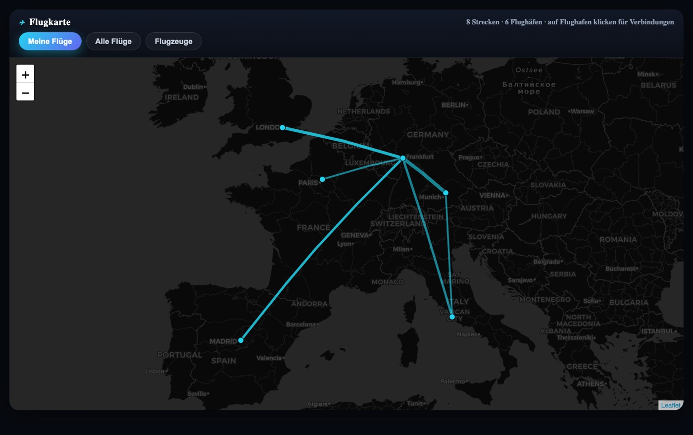
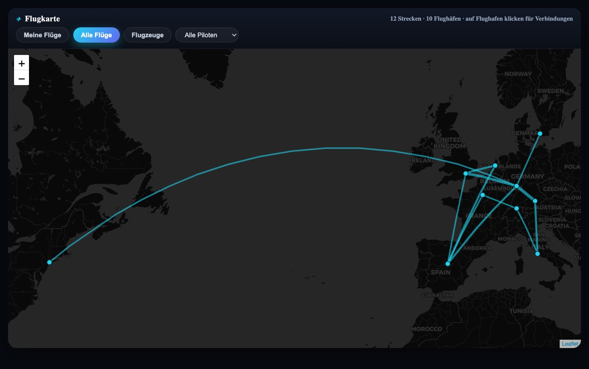
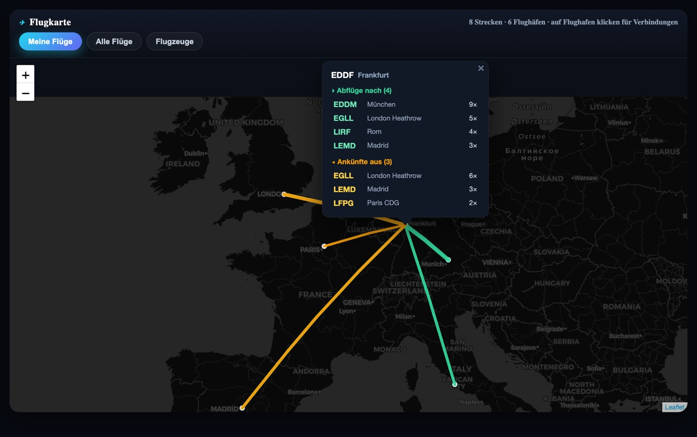
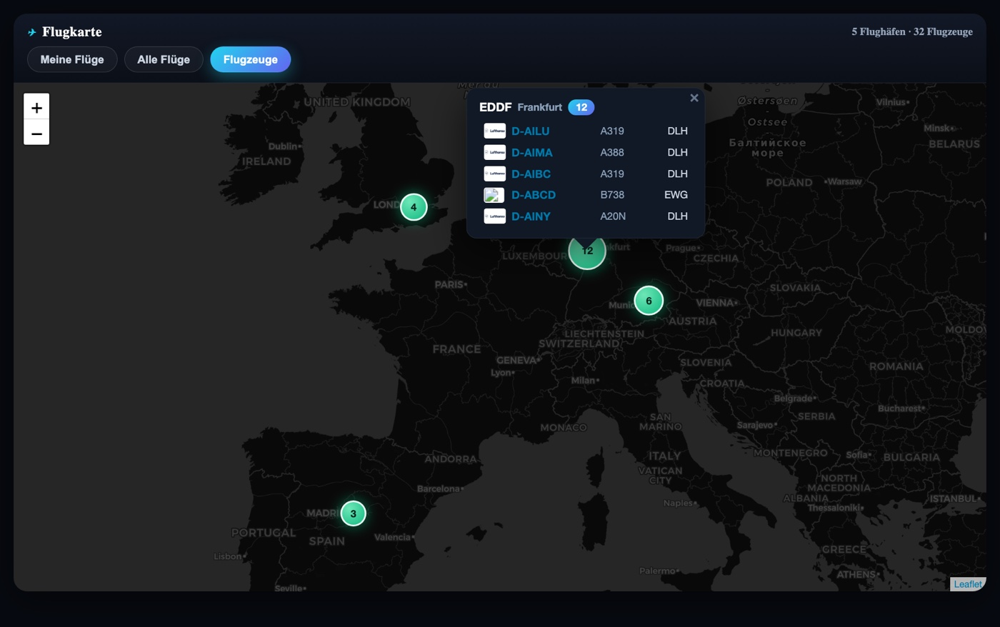

# FlightMap

An interactive flight map module for **phpVMS 7**. One page with three switchable
views, built on **Leaflet** with straight great-circle (`L.Geodesic`) lines on a
dark basemap.

> Made with ❤️ for the German Sky Group virtual airline.

## Features

- **My flights** – the logged-in pilot's accepted PIREPs as straight departure→arrival lines.
- **All flights** – every pilot's accepted PIREPs, with an optional **pilot filter**
  (only active pilots are listed). Identical routes are aggregated and line weight
  scales with how often the route was flown.
- **Aircraft** – where all aircraft currently are, grouped per airport. Marker size
  scales with the number of aircraft; the popup lists every aircraft with its
  **airline logo**, type and a link to the aircraft's detail page.
- **Click an airport** (in the route views) to highlight its connections:
  **departures in green, arrivals in amber**, everything else dimmed, plus a popup
  listing destinations and origins with counts. Click empty space to reset.
- Mouse-wheel zoom, dark theme, responsive popups/tooltips.

No flown ACARS tracks are loaded — the map draws clean A→B great-circle lines, so it
stays fast even with thousands of routes.

## Screenshots

| My flights | All flights (+ pilot filter) |
|:---:|:---:|
|  |  |
| **Click an airport → departures & arrivals** | **Aircraft locations** |
|  |  |

## Requirements

- phpVMS 7
- A frontend theme that exposes the bundled map helpers (`phpvms.map.render_base_map`)
  and `phpvms.request` (the stock themes do). Leaflet + `leaflet.geodesic` ship with phpVMS.
- *Optional:* [DisposableBasic](https://github.com/FatihKoz/DisposableBasic) — the
  aircraft popup links registrations to its `/daircraft/{registration}` overview page.
  Without it the links simply 404; everything else works.

## Installation

**Download:** grab `phpvms7_FlightMap-vX.Y.Z.zip` from the
[**latest release**](https://github.com/MANFahrer-GF/phpvms7_FlightMap/releases/latest).
The ZIP contains a single top-level `FlightMap/` folder.

### Option A — module installer (recommended)

If your phpVMS install has a module installer that accepts ZIP uploads
(e.g. ModuleCenter), just upload `phpvms7_FlightMap-vX.Y.Z.zip` there. It drops the
`FlightMap/` folder into `modules/` automatically. Then enable it (next step) if it
isn't enabled already.

### Option B — manual

1. Unzip the archive and copy the `FlightMap/` folder into your phpVMS `modules/`
   directory (so you end up with `modules/FlightMap/`).
2. Enable it and clear the view cache:
   ```bash
   php artisan module:enable FlightMap
   php artisan view:clear
   ```
3. Open **`/flightmap`** (the route is behind `auth`).

> The folder **must** be named `FlightMap` (it maps to the `Modules\FlightMap`
> namespace). Don't rename it.

### Add it to your navigation

The module registers a member-only frontend link (`addFrontendLink`) for the
Seven/Beta themes. For custom themes, add a link to `/flightmap` wherever you like, e.g.:

```blade
<a href="{{ url('/flightmap') }}"><i class="..."></i> Flight Map</a>
```

## How it works

| Part | File |
|------|------|
| Page route (`GET /flightmap`) | `Routes/web.php` |
| JSON endpoints (`/flightmap/my`, `/all`, `/aircraft`, `/pilots`) | `Routes/api.php` |
| Page controller | `Http/Controllers/Frontend/IndexController.php` |
| Data controller | `Http/Controllers/Api/MapController.php` |
| Map UI (Leaflet + Geodesic) | `Resources/views/index.blade.php` |
| Route + view/link registration | `Providers/RouteServiceProvider.php`, `Providers/AppServiceProvider.php` |

Data sources: accepted `pireps` (`dpt_airport_id`/`arr_airport_id` → `airports.lat/lon`)
for routes, and `aircraft.airport_id` for aircraft locations.

## License

MIT — see [LICENSE](LICENSE).
